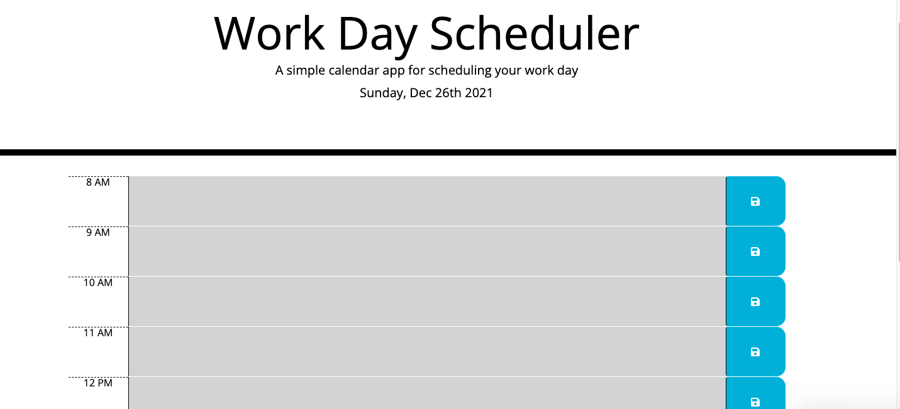

# Work Day Scheduler

[Link to Work Day Scheduler](https://marikadicarlo.github.io/WorkDayScheduler/)



## Work Day Scheduler Challenge
This Challenge required me to create a work day scheduler, using HTML, Javascript, and CSS which was provided. The application allows the user to create new tasks during the hours of 9:00am - 5:00pm.

Unfortunately, I am having trouble with local storage. When the webpage refreshes, the information is not saved.


## User Story
```
AS AN employee with a busy schedule
I WANT to add important events to a daily planner
SO THAT I can manage my time effectively
```

## Acceptance Criteria
```
GIVEN I am using a daily planner to create a schedule
WHEN I open the planner
THEN the current day is displayed at the top of the calendar
WHEN I scroll down
THEN I am presented with time blocks for standard business hours
WHEN I view the time blocks for that day
THEN each time block is color-coded to indicate whether it is in the past, present, or future
WHEN I click into a time block
THEN I can enter an event
WHEN I click the save button for that time block
THEN the text for that event is saved in local storage
WHEN I refresh the page
THEN the saved events persist
```

## Resources
https://www.w3schools.com/icons/tryit.asp?filename=tryicons_fa-save

https://getbootstrap.com/docs/4.0/layout/grid/

https://learn.jquery.com/using-jquery-core/document-ready/